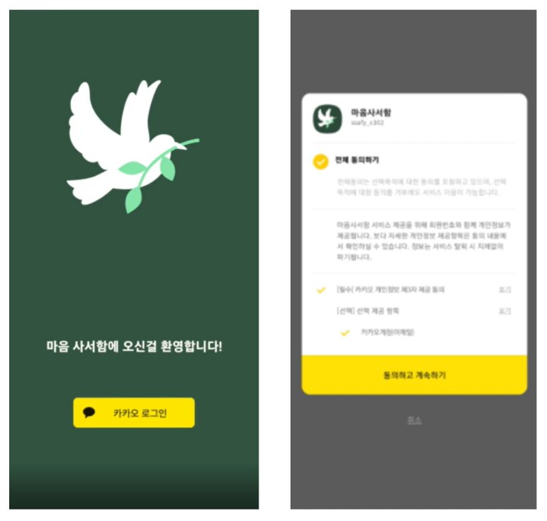
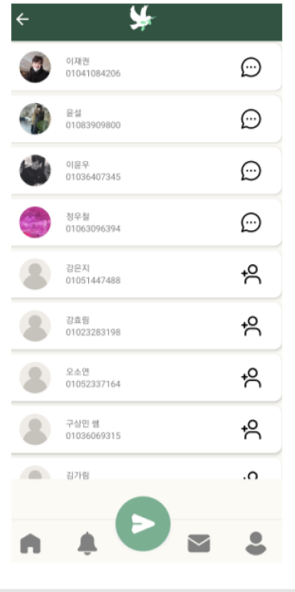
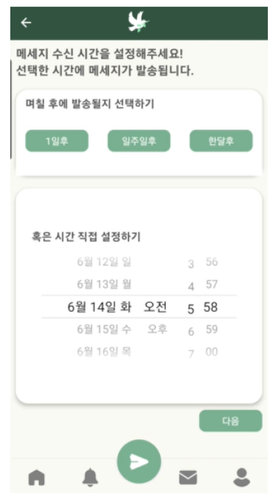
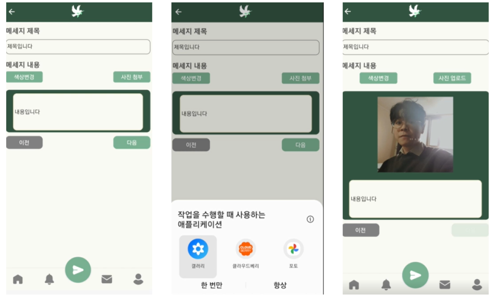
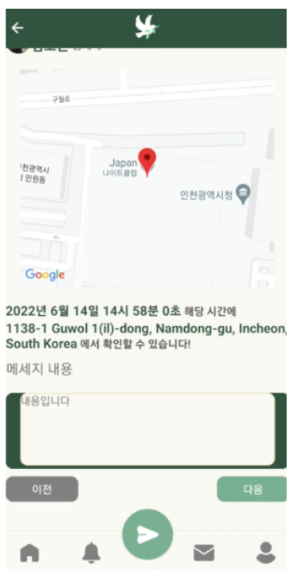
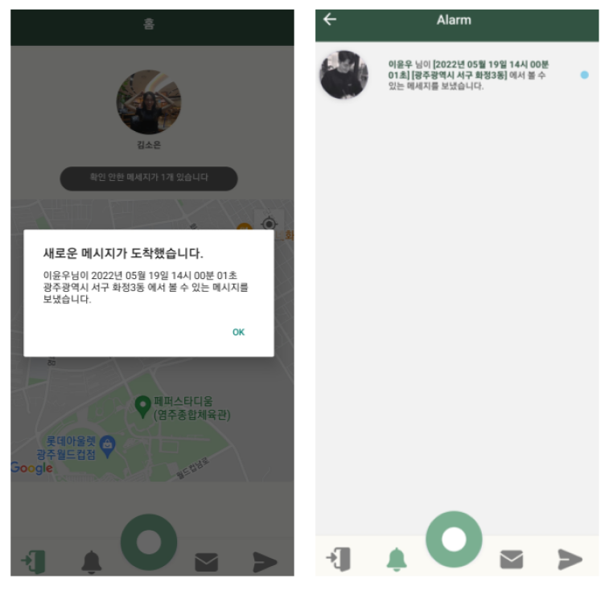
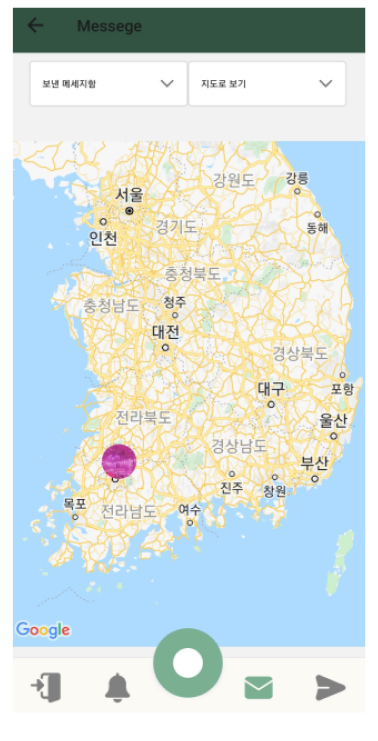
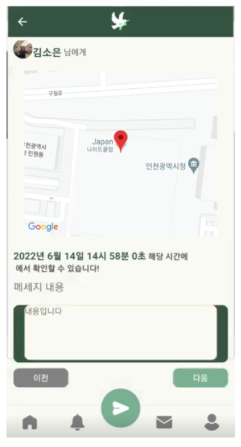

# 원하는 장소에 보내는 메세지, PORONG 🕊️

> 포롱🕊️ 
>
> 작은 새가 가볍게 날아오르는 소리를 뜻하는 '포롱거리다'에서 따온 말로 마음을 담은 메세지가 작은 새처럼 지정된 장소로 가는 모습을 비유하였다.

## 프로젝트 소개 :page_with_curl:

- 프로젝트명: 포롱
- 개발 기간: 2022.04.11 ~ 2022.05.20
- 서비스 특징 및 주요기능
  - 메세지에 시간과 공간 제약 부여
  - Firebase Clouding Messaging 을 이용한 알림 기능
  - 사용자 위치에 따른 메세지 열람(첫 번째 수신)
  - 실시간 랭킹 기능
  - 소셜 로그인 기능
  - 연락처 연동 기능
- 주요 기술
  - 프론트 엔드
    - React Native
    - Redux
    - React Navigation
    - Firebase Cloud Messaging (이하 FCM)
    - Google Maps
    - Geolocation
  - 백엔드
    - Spring boot
    - MySQL
    - Redis
    - ELK stack
    - Rest API

## 목차 :open_book:

**[1. 팀소개](#팀소개-🙌)**

**[2. 서비스 소개](#2.-서비스-소개-🎁)**

- 회원가입 및 로그인
- 메세지 전송
- 알림과 메세지 열람
- 메세지 보관함
- 메인 페이지
- 메세지 상세 페이지

**[3.프로젝트 명세](https://www.notion.so/README-421a3d50ced54e18a252f68208863415)**

- 아키텍처
- ERD
- UI 프토로타입
- API 명세서
- 요구사항 명세서

## 1. 팀소개 🙌

> 팀명 : 마음 사서함🤎

<table>
  <tr>
    <td align="center"><a href="https://github.com/Leeyounwoo"> <b>이윤우 Front-end</b></a> </td>
    <td align="center"><a href="https://github.com/computer98400"> <b>윤설 Front-end</b></a> </td>
    <td align="center"><a href="https://github.com/woosteelz"> <b>정우철 Front-end</b></a> </td>
    <td align="center"><a href=""> <b>이재권 Back-end, 팀장</b></a> </td>
    <td align="center"><a href="https://github.com/soeunstacykim"> <b>김소은 Back-end</b></a> </td>
    <td align="center"><a href="https://github.com/suhanchoi"> <b>최수한 Back-end</b></a> </td>
    </tr>
</table>

### **🧏‍♂️ Front-end**

- 이윤우
  - 페이지: [알림 페이지](#알림과-메세지-열람), [메세지 보관함 페이지](#메세지-보관함), [메세지 상세 페이지](#메세지-상세-페이지)
  - 담당
    - FCM과 Async Storage를 이용한 메세지 상태 관리
    -  Geolocation의 wathPosition을 이용한 사용자 위치 변화 감지
    - FCM을 이용한 푸시 알림 기능
    - 메세지 열람 상태에 따른 메세지 상세 페이지 분기 처리
    - useIsFocused Hook을 통한 페이지 리프레쉬

- 윤설:
  - 페이지: [메인 페이지](#메인-페이지), [메세지 전송](#메세지-전송), [메세지 상세 페이지](#메세지-상세-페이지)
  - 담당
    - google cloud platform 연결을 통한 어플리케이션 내의 지도 API
    - 메세지 전송을 위한 Redux적용
    - 메세지 보내기, 메인페이지 CSS 적용
    - 어플리케이션 배포 담당
- 정우철:
  - 페이지: [메세지 전송](#메세지-전송), [회원가입 및 로그인 페이지](#회원가입-및-로그인)
  - 담당
    - 카카오 로그인 API를 이용한 로그인 구현
    - useRef를 이용한 자동 줄바꿈 구현
    - Contact API를 이용한 연락처 동기화
    - react navigation을 이용한 하단 네비게이션 바 구현

### **🧏‍♀️ Back-end**

- 이재권
  - 기능: 사용자 인증 및 회원 관리 기능, FCM을 이용한 푸시 알림 기능
  - 담당
    - 젠킨스를 이용한 자동 배포 환경 설정
    - 사용자 인증 및 회원 관리 API 구현
    - Firebase Cloud Messaging을 이용한 푸시 알림 기능 구현

- 김소은
  - 기능: 로그인 및 회원가입, 타임캡슐 기능
  - 담당
    - 카카오 로그인 API를 이용한 로그인 및 회원가입 기능 구현
    - 추가기능 DB 설계 및 타임캡슐 작성 및 열람 API 구현

- 최수한
  - 기능: 메시지 기능, 장소 랭킹 기능
  - 담당
    - 메시지 작성 및 송수신 관련 API 구현
    - ELK Stack을 이용한 메시지 장소 랭킹 기능 구현
    - Naver Place API 를 이용한 장소 표시 기능 구현

## 2. 서비스 소개 🎁

### 회원가입 및 로그인

- 회원가입 및 휴대폰 인증

  

  - 카카오 계정을 이용하여 간단하게 회원가입을 할 수 있습니다.

  - 회원가입 이후 첫 로그인 시, 휴대폰 인증을 합니다.

- 로그인

  

  - 카카오 계정을 이용하여 로그인 할 수 있습니다.
  - 로그인 시마다 새로운 FCM 토큰 값을 받아와 사용자 토큰 정보를 업데이트한다.

  

### 메세지 전송

#### 수신자 지정 (정우철)

- 사용자 휴대폰의 연락처에 접근하여 이미 가입된 사용자는 친구라고 간주하여 별도의 친구 추가 과정을 거치지 않고 메세지를 보낼 수 있습니다.

- 아직 서비스에 가입하지 않은 연락처 내의 지인에게 서비스 초대 문자를 전송할 수 있습니다.

#### 시간 지정 (정우철)

- 1일 후, 일주일후, 한달후 버튼으로 간단하게 시간 조건을 지정할 수 있습니다.

- 혹은 직접 시간을 설정할 수도 있습니다.

#### 장소 지정 (윤설)

- 주소를 입력하여 장소를 선택할 수 있습니다.
- 지도를 직접 클릭하여 장소를 지정할 수 있습니다.

#### 내용 및 사진 입력 (윤설)

- 메세지 제목, 내용을 입력할 수 있습니다.
- 메세지에 사진을 첨부하여 보낼 수 있습니다.
- 편지지의 색상을 바꿀 수 있습니다.

#### 내용 확인 (윤설)

- 지금까지 메세지에 설정한 값(수신자, 시간, 장소, 제목, 내용, 사진, 편지지 색상 등)들을 확인할 수 있습니다.

#### 메세지 타입 지정 및 전송 (정우철)

- 일반 메세지를 통해 수신자에게 메세지 수신 사실과 조건을 알릴 수 있습니다.
- 비밀 메세지를 통해 수신자에게 메세지 수신 사실과 조건을 숨길 수 있습니다.

### 알림과 메세지 열람

- 메세지 조건 알림

  

  - 일반 메세지의 경우, FCM의 Notification을 설정하여 사용자의 화면에 푸시 알림을 띄운다.
  - 비밀 메세지의 경우, Notification을 설정하지 않아 사용자의 화면에 푸시 알림을 띄우지 않고 알림을 받는다.
  - 메세지의 타입에 상관없이 메세지의 위도, 경도 값을 받아 Async Storage에 저장한다.

- 사용자 위치와 메세지 열람 조건 확인과 열람 요청

  - 사용자의 위치가 50m이동할 때마다 Async Storage에 저장된 메세지 위치와 사용자의 위치를 비교한다.
  - 만약 메세지 열람 조건 만족 시, Async Storage에서 해당 메세지를 삭제하고 받은 메세지 목록에 추가한다. 
  - 또, 서버에 메세지 열람 요청을 보낸다.
  
- 메세지 열람 알림

  - 메세지 열람 성공 시 메세지 열람 확인 알림을 받습니다.

### 메세지 보관함

- 받은 메세지와 보낸 메세지를 확인할 수 있습니다.
- 목록으로 볼 수도 있고 지도로 볼 수도 있습니다.
- 메세지 클릭시 메세지 상세 페이지로 이동합니다.

### 메인 페이지

- 아직 확인하지 못한 메세지들의 수를 보여준다.
- 메세지들의 위치를 지도상의 마커로 보여준다.
- 마커 클릭 시 메세지 상세 페이지로 이동한다.

### 메세지 상세 페이지

- 아직 열람하지 못한 메세지는 발신자, 시간 조건, 장소 조건을 볼 수 있습니다.
- 이미 열람한 메세지(Async Storage 내의 열람한 메세지 Set)에 있는 경우엔, 메세지 내용, 사진 등을 추가로 확인할 수 있습니다.

## **3. 프로젝트 명세 🛠**

### **3.1 아키텍처**

### **3.2 ERD**

### **3.3 API 명세서**

[API_명세서.html](https://www.notion.so/API-29589b6ccda64cefad0c2053d27f52b1)
